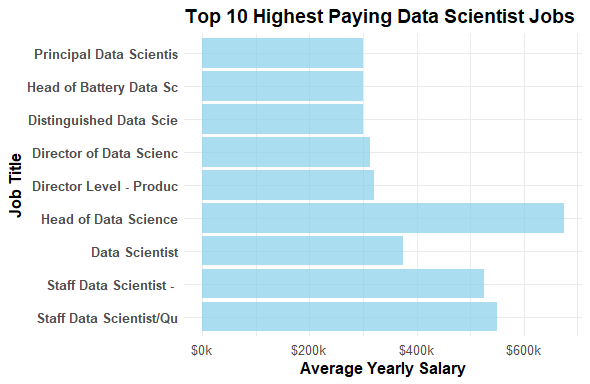
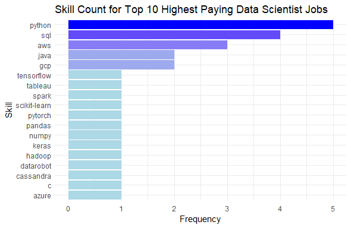

# Introduction
📊 Welcome to an exploration of the data job market! This project delves into the realm of data scientist roles, uncovering 💰 top-paying jobs, 🔥 in-demand skills, and 📈 intersections where high demand meets high salary in the field of data science.

🔎 Curious about the SQL queries used? Check them out [here](project_sql_queries/)

# Background

## Dataset

The dataset used for this analysis originates from a comprehensive [SQL Course](https://lukebarousse.com/sql), featuring rich insights on job titles, salaries, locations, and essential skills. Job listings were gathered throughout 2023 using a specialized [app](https://datanerd.tech) developed by the course leader. The dataset is hosted externally on Google Drive. You can access it [here](https://drive.google.com/drive/folders/1moeWYoUtUklJO6NJdWo9OV8zWjRn0rjN).

Additionally, CSV files generated from SQL queries that were used for data visualizations can be found [here](sql_query_csv_results/). Visualizations were created using ggplot2 in RStudio. The R script file containing the code for SQL query 1 and 2 visualizations can be found [here](R_scripts/R_visualizations.R).

## Project Overview

Driven by a desire to better understand the data scientist job market and identify the most lucrative and sought-after skills, this project aimed to streamline the job search process for others seeking optimal positions in the data science field. Additionally, this project provided a valuable opportunity for me to become proficient in SQL and demonstrate my capability to perform advanced queries.

## Objectives
Throughout this project, I sought answers to the following key questions through SQL queries:

1. What are the top-paying data scientist jobs?
2. What skills are required for these top-paying jobs?
3. What skills are most in demand for data scientists?
4. Which skills are associated with higher salaries?
5. What are the most optimal skills to learn?

# Tools I Used
For my exploration of the data scientist job market, I utilized:

- **SQL:** Essential for querying and analyzing the dataset, providing insights into data scientist job trends.
- **PostgreSQL:** Chosen for its robust database management capabilities, ideal for handling and analyzing job postings data.
- **Visual Studio Code:** Used for writing and executing SQL queries, providing a user-friendly environment for project management.
- **Git and GitHub:** Employed for version control and potential collaboration, enabling future sharing of SQL scripts and analysis with others.
- **R:** Utilized for data visualization to create insightful graphics based on the queried data.
- **RStudio:** Served as the integrated development environment for writing and running R scripts, facilitating data visualization.

This project marked my first experience with SQL, PostgreSQL, Visual Studio Code, and Git/GitHub, allowing me to gain valuable skills in database management, SQL querying, version control, and preparing for potential collaboration on GitHub. While I have prior experience with R and RStudio, I further refined my ability to visualize data by exporting SQL query results as CSVs and creating visualizations in RStudio.

# Analysis of Remote Data Scientist Positions
Each query for this project aimed at investigating specific aspects of the data scientist job market, with a particular focus on remote positions. Here's how I approached each question:

## 1. Top-Paying Remote Data Scientist Jobs
To identify the highest-paying roles, I filtered data scientist positions by average yearly salary and location, with a focus on remote roles. This query highlights lucrative career options within the field of data science.

```sql
SELECT
    job_id,
    job_title,
    job_location,
    job_schedule_type,
    salary_year_avg,
    job_posted_date,
    name AS company_name
FROM
    job_postings_fact
LEFT JOIN
    company_dim ON job_postings_fact.company_id = company_dim.company_id
WHERE
    job_title_short = 'Data Scientist' AND
    job_location = 'Anywhere' AND
    salary_year_avg IS NOT NULL
ORDER BY
    salary_year_avg DESC
LIMIT 10;
```
### Key Findings

- **Wide Salary Range:** Top 10 paying remote data scientist roles span from $300,000 to $550,000, indicating significant salary potential in the field.
- **Diverse Employers:** Companies like Walmart, Reddit, and Selby Jennings are among those offering high salaries, showing a broad interest across different industries.
- **Job Title Variety:** There's a high diversity in job titles, from Data Scientist to Director of Data Science & Analytics, reflecting varied roles and specializations within data science.

### Visualizing Top Salaries

To visualize the top 10 highest paying remote data scientist jobs based on average yearly salary, I used the following R code. The [CSV file](sql_query_csv_results/top_salaries_data_scientist.csv) used contains the results from the first SQL query:

```r
# Load necessary libraries
library(ggplot2)
library(readr) # For reading CSV file
library(scales) # For formatting

# Read the CSV file
data <- read_csv("top_salaries_data_scientist.csv")  # Replace with your location of the file

# Ensure salary_year_avg is numeric
data$salary_year_avg <- as.numeric(data$salary_year_avg)

# Take top 10 salaries
top_10 <- head(data, 10)

# Truncate job titles to make them shorter
top_10$job_title <- substr(top_10$job_title, 1, 23)

# Create a horizontal bar plot with formatted salary labels
ggplot(top_10, aes(x = salary_year_avg, y = reorder(job_title, -salary_year_avg))) +
  geom_bar(stat = "identity", fill = "skyblue", alpha = 0.7) +
  labs(title = "Top 10 Highest Paying Data Scientist Jobs",
       x = "Average Yearly Salary",
       y = "Job Title") +
  scale_x_continuous(labels = dollar_format(prefix = "$", suffix = "k", scale = 1e-3)) +  # Format salary labels
  theme_minimal() +
  theme(axis.text.y = element_text(face = "bold", size = 10),
        axis.text.x = element_text(size = 10),
        axis.title = element_text(size = 12, face = "bold"),
        plot.title = element_text(size = 14, face = "bold"))
```
The resulting bar graph from the above R code is shown below:


## 2. Skills for Top Paying Remote Data Scientist Jobs
To understand the skills required for the top-paying remote data scientist jobs, I integrated job postings data with skills data. Each job-skill combination was captured, offering insights into the specific skills employers prioritize for high-compensation roles.

```sql
WITH top_paying_jobs AS (

    SELECT
        job_id,
        job_title,
        salary_year_avg,
        name AS company_name
    FROM
        job_postings_fact
    LEFT JOIN
        company_dim ON job_postings_fact.company_id = company_dim.company_id
    WHERE
        job_title_short = 'Data Scientist' AND
        job_location = 'Anywhere' AND
        salary_year_avg IS NOT NULL
    ORDER BY
        salary_year_avg DESC
    LIMIT 10
)

SELECT
    top_paying_jobs.*,
    skills --from skills_dim table
FROM top_paying_jobs
INNER JOIN skills_job_dim ON top_paying_jobs.job_id = skills_job_dim.job_id
INNER JOIN skills_dim ON skills_job_dim.skill_id = skills_dim.skill_id
ORDER BY
    salary_year_avg DESC;
```
### Key Findings:

- **Python** is the most demanded skill, appearing in 5 out of 10 top-paying remote data scientist roles.
- **SQL** follows closely with 4 mentions, highlighting its fundamental role.
- **AWS** is also highly sought after, with a count of 3, reflecting the importance of cloud computing skills.
- Other skills such as **Java**, **GCP**, **TensorFlow**, and **Tableau** show varying degrees of demand.

### Visualizing Skills for Top Paying Jobs

To visualize the count of skills for the top 10 highest paying remote data scientist jobs, I used the following R code. The [CSV file](sql_query_csv_results/top_paying_job_skills_data_scientist.csv) used contains the results from the second SQL query:

```r
# Load necessary library
library(ggplot2)

# Read the CSV file
skills_data <- read.csv("top_paying_job_skills_data_scientist.csv")

# Count the frequency of each skill
skill_counts <- table(skills_data$skill)
skill_counts <- as.data.frame(skill_counts)
colnames(skill_counts) <- c("skill", "count")

# Create a bar plot for skill counts with reversed order and gradient color
ggplot(skill_counts, aes(x = reorder(skill, count), y = count, fill = count)) +
  geom_bar(stat = "identity") +
  coord_flip() +  # Flip coordinates to make it horizontal
  labs(title = "Skill Count for Top 10 Highest Paying Data Scientist Jobs",
       x = "Skill",
       y = "Frequency") +
  scale_fill_gradient(low = "lightblue", high = "blue") +  # Gradient color
  theme_minimal() +
  theme(legend.position = "none")  # Hide the legend
```
The resulting bar graph from the above R code is shown below:


## 3. In-Demand Skills for Remote Data Scientists
This query identified and ranked the top 5 skills most in demand for data scientist roles that offer work-from-home opportunities.

```sql
SELECT
    skills,
    COUNT(skills_job_dim.job_id) AS demand_count
FROM job_postings_fact
INNER JOIN skills_job_dim ON job_postings_fact.job_id = skills_job_dim.job_id
INNER JOIN skills_dim ON skills_job_dim.skill_id = skills_dim.skill_id
WHERE
    job_title_short = 'Data Scientist' AND
    job_work_from_home = TRUE
GROUP BY
    skills
ORDER BY
    demand_count DESC
LIMIT 5;
```
### Key Findings

- **Python** and **SQL** remain fundamental, emphasizing the need for strong foundational skills in data manipulation, analysis, and machine learning model development.
- **R**, **AWS**, and **Tableau** are also crucial, indicating high demand for statistical analysis, cloud computing skills, and advanced data visualization capabilities in complex data science projects.

### Visualizing Top 5 Demanded Skills
Below is a table of the top 5 most in-demand skills in remote data scientist job postings that were generated from the third SQL query:

| Skills      | Demand Count |
|-------------|--------------|
| Python      | 10390        |
| SQL         | 7488         |
| R           | 4674         |
| AWS         | 2593         |
| Tableau     | 2458         |

## 4. Skills Based on Salary for Remote Data Scientist Roles
This SQL query was designed to provide insights into the most lucrative skills for remote data scientist roles. By aggregating average salaries associated with each skill and ranking them, it aimed to identify which skills commanded higher compensation in the remote job market for data scientists.


```sql
SELECT
    skills,
    ROUND(AVG(salary_year_avg)) AS avg_salary
FROM job_postings_fact
INNER JOIN skills_job_dim ON job_postings_fact.job_id = skills_job_dim.job_id
INNER JOIN skills_dim ON skills_job_dim.skill_id = skills_dim.skill_id
WHERE
    job_title_short = 'Data Scientist'
    AND job_work_from_home = TRUE
    AND salary_year_avg IS NOT NULL
GROUP BY
    skills
ORDER BY
    avg_salary DESC
LIMIT 25;
```
### Key Findings

- **Advanced Programming Languages:** Skills in Golang and PHP showcase expertise in modern programming languages, essential for developing efficient and scalable data solutions.
- **Data Analytics, Visualization, and Statistical Modeling:** Proficiency in tools like OpenCV, Neo4j, and Tidyverse highlights capabilities in advanced analytics, graph databases, statistical modeling, and data visualization, crucial for interpreting complex data, deriving insights, and optimizing data-driven processes.
- **Business Intelligence and Compliance Tools:** Mastery of platforms such as MicroStrategy and GDPR tools reflects skills in translating complex data into actionable insights and ensuring compliance with data regulations.

### Visualizing Most Lucrative Skills
Below is a table of the average salary for the top 10 highest-paying skills for remote data scientists, generated from the fourth SQL query:

| Skill          | Average Salary ($) |
|----------------|--------------------|
| GDPR           | 217,738            |
| Golang         | 208,750            |
| Atlassian      | 189,700            |
| Selenium       | 180,000            |
| OpenCV         | 172,500            |
| Neo4j          | 171,655            |
| MicroStrategy  | 171,147            |
| DynamoDB       | 169,670            |
| PHP            | 168,125            |
| Tidyverse      | 165,513            |

## 5. Most Optimal Skills for Remote Data Scientists
This query identifies and ranks the top 25 skills for remote data scientists, focusing on skills that are both highly demanded (more than 10 job postings) and offer high average salaries. By combining insights from demand and salary data, it provides strategic guidance for skill development in the data science field.

```sql
SELECT
    skills_dim.skill_id,
    skills_dim.skills,
    COUNT(skills_job_dim.job_id) AS demand_count,
    ROUND(AVG(job_postings_fact.salary_year_avg)) AS avg_salary
FROM
    job_postings_fact
INNER JOIN skills_job_dim ON job_postings_fact.job_id = skills_job_dim.job_id
INNER JOIN skills_dim ON skills_job_dim.skill_id = skills_dim.skill_id
WHERE
    job_title_short = 'Data Scientist'
    AND salary_year_avg IS NOT NULL
    AND job_work_from_home = TRUE
GROUP BY
    skills_dim.skill_id
HAVING
    COUNT(skills_job_dim.job_id) > 10
ORDER BY
    avg_salary DESC,
    demand_count DESC
LIMIT 25;
```

### Key Findings:

- **High-Demand Programming Languages and Tools:** Python stands out with the highest demand count of 763 and an average salary of $143,828, indicating its crucial role in data science. C and Go are also highly valued, with demand counts of 48 and 57, and high average salaries of $164,865 and $164,691 respectively, reflecting the importance of versatile programming skills.
- **Cloud Tools and Big Data Technologies:** Skills in AWS, GCP, and Snowflake show significant demand with average salaries of $149,630, $155,811, and $152,687 respectively, highlighting the importance of cloud platforms and big data technologies in data science. BigQuery, Redshift, and Spark are also in demand, with average salaries of $157,142, $151,708, and $150,188, pointing to the need for expertise in managing and analyzing large datasets.
- **Machine Learning and AI Tools:** TensorFlow and PyTorch are essential for machine learning, with high demand counts of 126 and 115, and average salaries of $151,536 and $152,603, respectively, indicating their critical role in building AI models. Scikit-learn and Pandas are also important, with average salaries of $148,964 and $144,816, showing the value of these libraries in data manipulation and machine learning.
- **Business Intelligence and Data Visualization:** Tableau and Looker are critical for data visualization, with demand counts of 219 and 57, and average salaries of $146,970 and $158,715, respectively, underscoring the importance of visualizing data insights for business decision-making. Qlik also features prominently, with a significant average salary of $164,485, reflecting its value in business intelligence.
- **Development and Deployment Tools:** Airflow and Kubernetes are essential for workflow management and container orchestration, with average salaries of $157,414 and $144,498, respectively, highlighting the importance of these tools in deploying and managing data science projects.

### Visualizing Most Optimal Skills
The table below displays the most optimal skills for remote data scientists, ranked first by salary and then by demand. This data was derived from the fifth SQL query:

| Skill         | Demand Count | Average Salary ($) |
|---------------|--------------|--------------------|
| C             | 48           | 164,865            |
| Go            | 57           | 164,691            |
| Qlik          | 15           | 164,485            |
| Looker        | 57           | 158,715            |
| Airflow       | 23           | 157,414            |
| BigQuery      | 36           | 157,142            |
| Scala         | 56           | 156,702            |
| GCP           | 59           | 155,811            |
| Snowflake     | 72           | 152,687            |
| Pytorch       | 115          | 152,603            |

# What I Learned

Throughout this project, I've strengthened my SQL capabilities significantly:

- **🧩 Complex Query Crafting:** I've mastered advanced SQL techniques, adeptly merging tables and utilizing WITH clauses for sophisticated temporary data manipulations.
  
- **📊 Data Aggregation:** I've honed my skills in data summarization using GROUP BY and leveraging aggregate functions like COUNT() and AVG() to derive meaningful insights.

- **💡 Analytical Mastery:** I've sharpened my ability to transform complex questions into actionable insights, showcasing my analytical prowess through SQL queries.


# Conclusions

## Insights
From the analysis, several general insights emerged:
1. **Top-Paying Data Scientist Jobs:** The highest-paying jobs for data scientists that allow remote work offer a wide range of salaries, the highest of $550,000!
2. **Skills for Top-Paying Jobs:** Advanced proficiency in Python and SQL emerges as crucial for securing high-paying remote data scientist roles, reflecting their importance in the field.
3. **Most In-Demand Skills:** Python stands out as the most sought-after skill among remote data scientist job postings, with SQL following closely behind, emphasizing their essential roles in the profession and making them indispensable skills for job seekers.
4. **Skills with Higher Salaries:** Specialized skills such as GDPR and Golang are associated with the highest average salaries among remote data scientists, demonstrating a premium on niche expertise in areas like data privacy and programming languages.
5. **Optimal Skills for Job Market Value:** Python stands out as the most essential skill for remote data scientists, appearing in a staggering 763 job postings and offering a high average salary. This underscores its critical role as a cornerstone programming language in the data science field. SQL, GCP, and AWS also show considerable demand and command high average salaries, making them pivotal skills for aspiring data scientists looking to maximize their market value.

## Closing Thoughts
This project has significantly advanced my SQL proficiency and deepened my understanding of the data scientist job market. The insights gained provide a roadmap for prioritizing skill development and optimizing job search strategies. Aspiring data scientists can strategically position themselves in a competitive job market by focusing on skills that are both in high demand and offer lucrative salaries. This exploration underscores the importance of continuous learning and adaptability to evolving trends within the dynamic field of data science.
